# BUPT-pokemon
北邮c++大作业 宠物小精灵对战系统
# 课程设计报告

2018211303 	2018211165 	李一博

## 总体方案设计说明

### 软件开发环境

- **编程语言**：c++
- **版本库**： Qt 5.12.7
- **数据库**：mysql 
- **IDE**：Qt Creator
- **系统**：Windows10

### 窗口界面设计

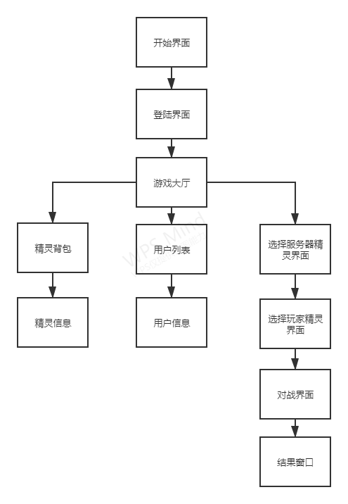

### 模块清单

|       模块名称       |  模块标识符  |           模块说明           |
| :------------------: | :----------: | :--------------------------: |
|       开始窗口       |    Widget    |           开始界面           |
|       登陆窗口       |    Login     | 用于完成登陆、注册功能的窗口 |
|       游戏大厅       |    Lobby     |           游戏大厅           |
|       背包界面       |  BagWidget   |     显示用户所有的小精灵     |
|    小精灵信息界面    |  SpiritInfo  |       显示小精灵的信息       |
|       用户列表       |   UserList   |      显示所有用户的信息      |
|     用户信息窗口     |   UserInfo   |        显示用户的信息        |
| 选择服务器小精灵窗口 |    Choose    |  选择参加对战的服务器小精灵  |
|  选择玩家小精灵窗口  |   Choose2    |   选择参加对战的玩家小精灵   |
|       对战界面       | FightWidget  |         显示对战过程         |
|       结果界面       | ResultWidget |         显示对战结果         |

## 图形界面设计

- 开始界面

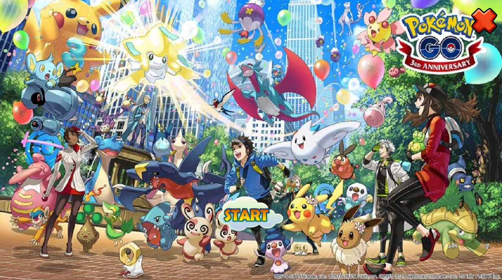

- 登陆界面

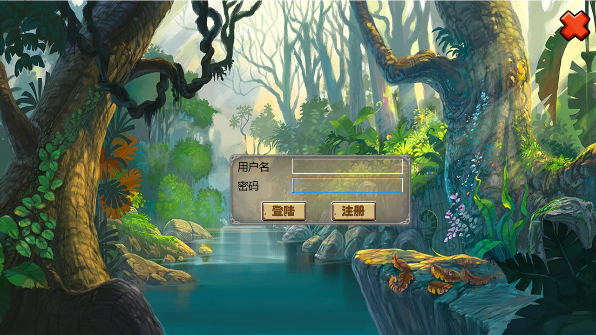

- 游戏大厅

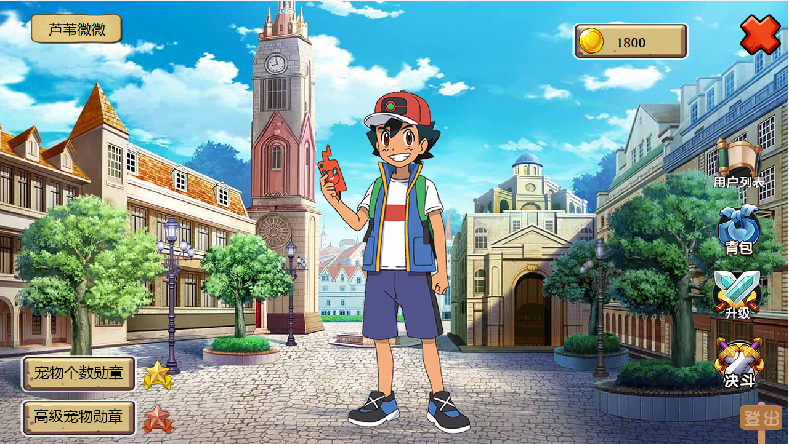

- 用户列表

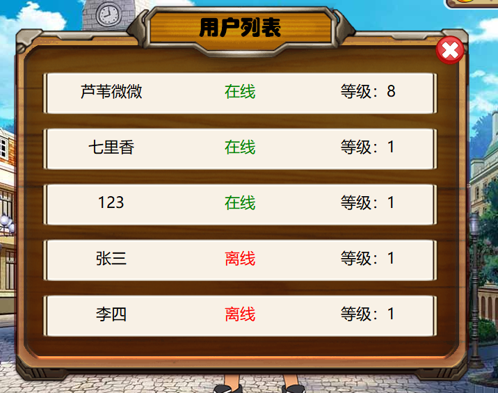

- 用户信息

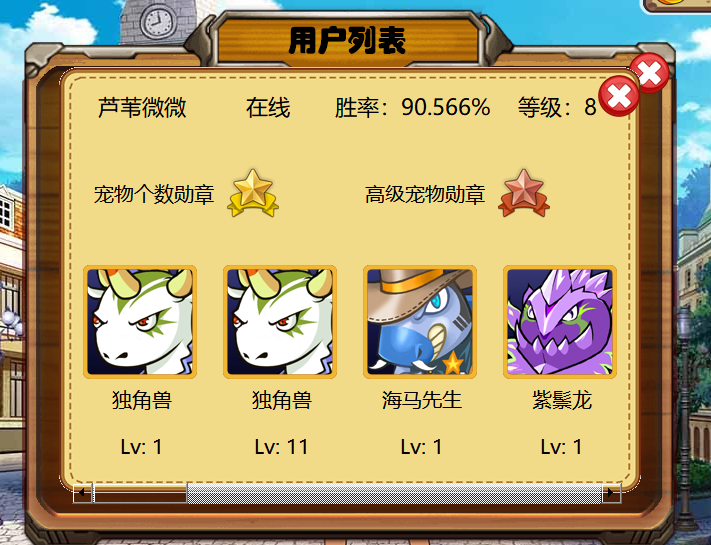

- 背包界面

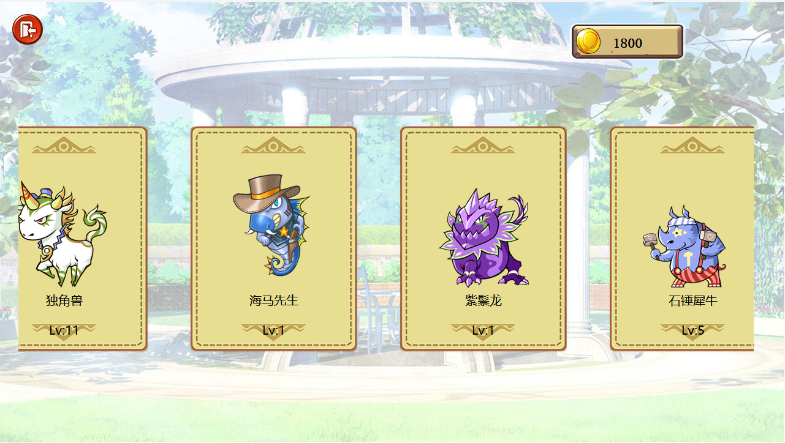

- 小精灵信息界面

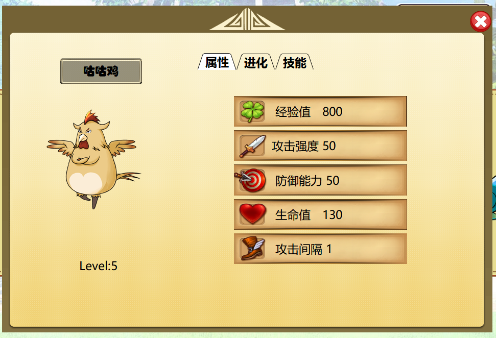

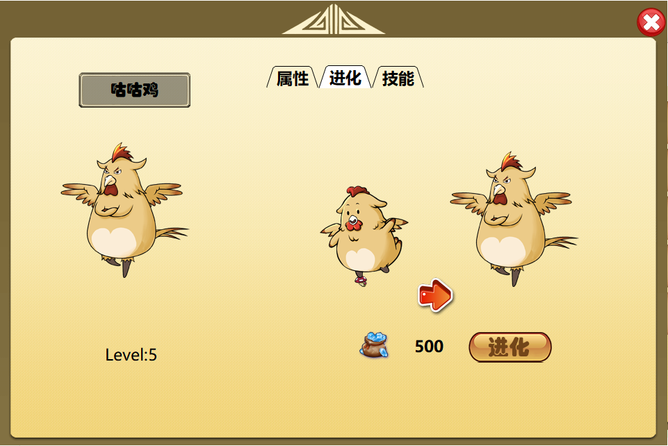


- 选择服务器对战精灵

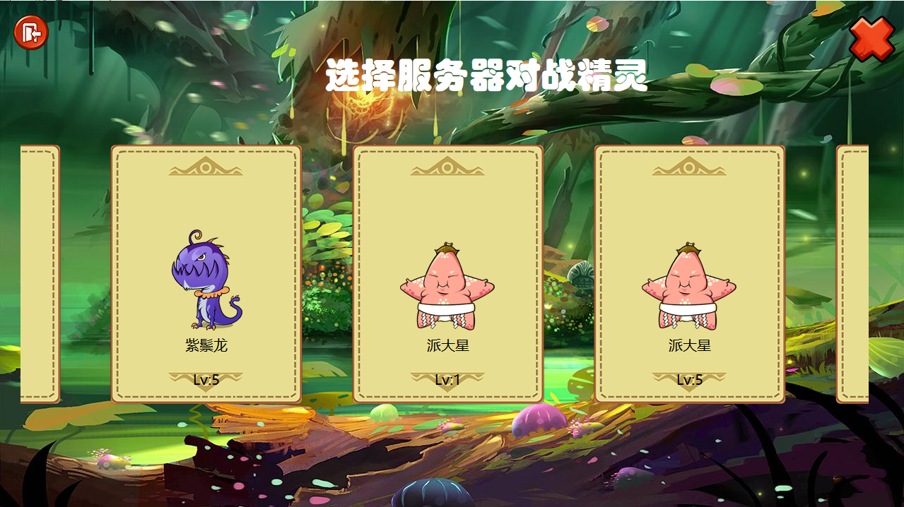

- 选择玩家对战精灵

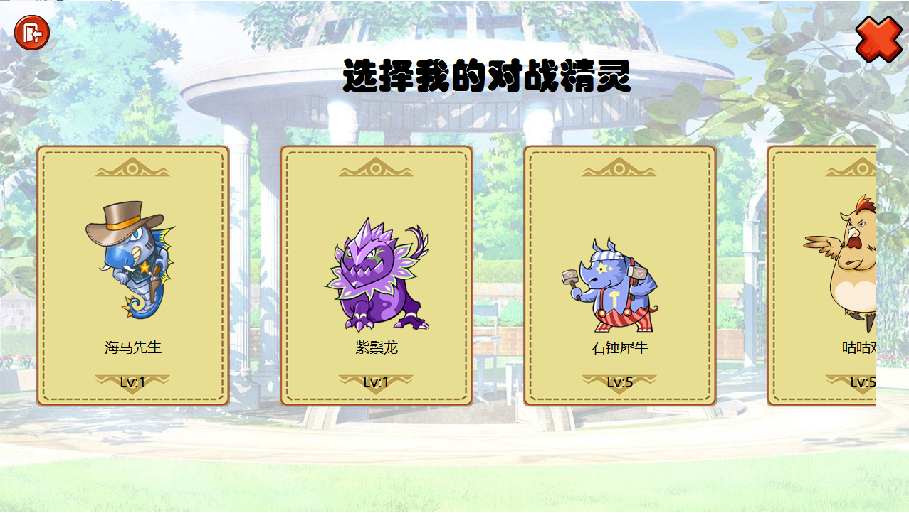

- 对战界面

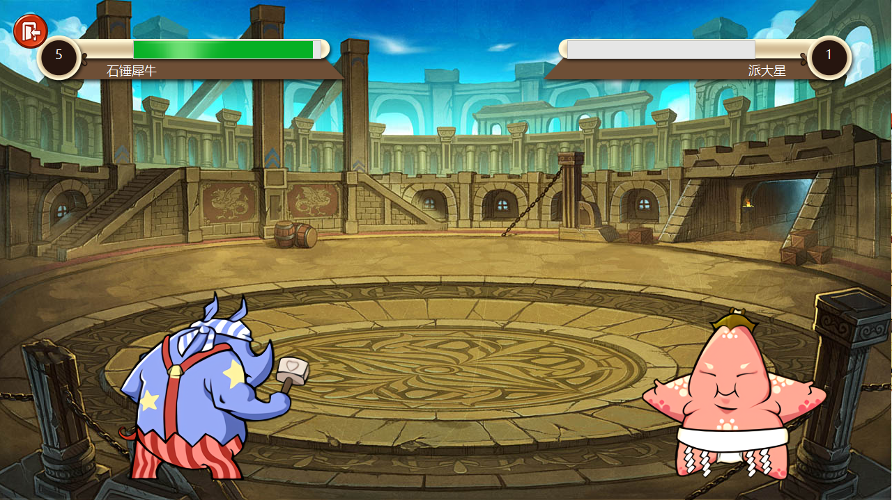

- 结果界面

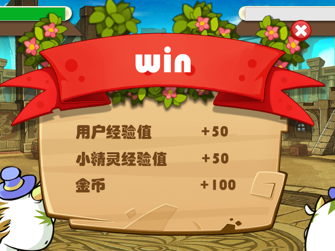

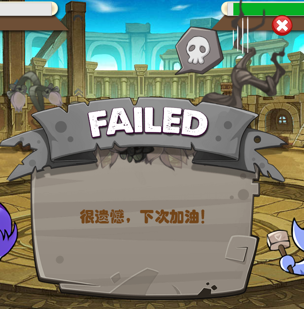

## 

## 小精灵类设计说明

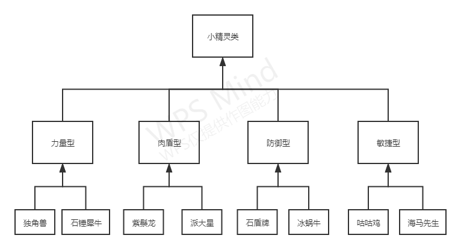

### 小精灵抽象基类设计

```c++
class Pokemon
{
protected:
    //属性
    QString name;//名字
    QString attackName;//攻击名
    int id;//编号（唯一）
    int grade;//等级
    bool evolved;//是否进化 （到达8级之后可以进化）
    bool skillEvolved;//技能是否进化
    int exp;//经验值
    int atta;//攻击力
    int defense;//防御力
    int hp;//生命值
    int interval;//攻击间隔

    //方法
public:
    Pokemon();//构造函数
    Pokemon(QString spirit_name, int grade, int evolved, int exp, int attack, int defend, int hp, int interval, int skillEvolved);
    virtual void upgrade() = 0;//升级
    virtual void attack(Pokemon *) = 0;//攻击函数
    bool isDead() const;//判断是否死亡
    QString getAttackName() const;//获取攻击名
    int getID() const;//获取小精灵ID
    bool isEvolved() const;//小精灵是否进化
    bool isSkillEvolved() const;//小精灵技能是否进化
    void setEvolved(bool evol);//设置小精灵是否进化
    void setSkillEvolved(bool evol);//设置小精灵技能是否进化
    int getExp() const;//获取小精灵经验值
    int getAtta() const;//获取小精灵攻击值
    int getDefense() const;//获取小精灵防御值
    int getHp() const;//获取小精灵HP
    int getInterval() const;//获取小精灵攻击间隔
    void setExp(int value);//设置小精灵经验值
    void setAtta(int value);//设置小精灵攻击值
    void setDefense(int value);//设置小精灵防御值
    void setHp(int value);//设置小精灵HP
    void setInterval(int value);//设置小精灵攻击间隔
    int getGrade() const;//获得小精灵等级
    void setGrade(int gra);//设置小精灵等级
    QString getName() const;//获取小精灵姓名
};

```

### 力量型小精灵

```c++
class Attack :public Pokemon
{
public:
    Attack() {}
    virtual void attack(Pokemon *) = 0;//攻击函数
    void upgrade();
};
```

### 肉盾型小精灵

```
class Hp :public Pokemon
{
public:
    //Hp();
    virtual void attack(Pokemon *) = 0;//攻击函数
    void upgrade();
};
```

### 防御型小精灵

```c++
class Defend :public Pokemon
{
public:
    Defend() {}
    virtual void attack(Pokemon *) = 0;//攻击函数
    void upgrade();
};
```

### 敏捷型小精灵

```c++
class Interval :public Pokemon{
public:
    Interval() {}
    virtual void attack(Pokemon *) = 0;//攻击函数
    void upgrade();
};

```

### 独角兽

```c++
class Horse :public Attack
{
public:
    Horse(int _grade, int _evolved, int _exp, int _attack, int _defend, int _hp, int _interval, int _skillEvolved) {
        name = "独角兽";
        grade = _grade;
        evolved = (bool)_evolved;
        exp = _exp;
        atta = _attack;
        defense = _defend;
        hp = _hp;
        interval = _interval;
        skillEvolved = (bool)_skillEvolved;
    }

    Horse() {
        name = "独角兽";
    }
    void attack(Pokemon *enemy);
    ~Horse() {}
};
```

### 石锤犀牛

```c++
class Ox :public Attack
{
public:
    Ox(int _grade, int _evolved, int _exp, int _attack, int _defend, int _hp, int _interval, int _skillEvolved) {
        name = "石锤犀牛";
        grade = _grade;
        evolved = (bool)_evolved;
        exp = _exp;
        atta = _attack;
        defense = _defend;
        hp = _hp;
        interval = _interval;
        skillEvolved = (bool)_skillEvolved;
    }

    void attack(Pokemon *enemy);
    ~Ox() {}
};


```

### 紫鬃龙

```c++
class Dragon :public Hp
{
public:
    Dragon(int _grade, int _evolved, int _exp, int _attack, int _defend, int _hp, int _interval, int _skillEvolved) {
        name = "紫鬃龙";
        grade = _grade;
        evolved = (bool)_evolved;
        exp = _exp;
        atta = _attack;
        defense = _defend;
        hp = _hp;
        interval = _interval;
        skillEvolved = (bool)_skillEvolved;
    }
    void attack(Pokemon *enemy);
};

```

### 派大星

```c++
class Star :public Hp
{
public:
    Star(int _grade, int _evolved, int _exp, int _attack, int _defend, int _hp, int _interval, int _skillEvolved) {
        name = "派大星";
        grade = _grade;
        evolved = (bool)_evolved;
        exp = _exp;
        atta = _attack;
        defense = _defend;
        hp = _hp;
        interval = _interval;
        skillEvolved = (bool)_skillEvolved;
    }
    void attack(Pokemon *enemy);
};

```

### 石盾牌

```c++
class Rock :public Defend
{
public:
    Rock() {
        name = "石盾牌";
    };
    Rock(int _grade, int _evolved, int _exp, int _attack, int _defend, int _hp, int _interval, int _skillEvolved) {
        name = "石盾牌";
        grade = _grade;
        evolved = (bool)_evolved;
        exp = _exp;
        atta = _attack;
        defense = _defend;
        hp = _hp;
        interval = _interval;
        skillEvolved = (bool)_skillEvolved;
    }
    void attack(Pokemon *enemy);
};
```

### 冰蜗牛

```c++
class Snail :public Defend
{
public:
    Snail() {
        name = "冰蜗牛";
    }
    Snail(int _grade, int _evolved, int _exp, int _attack, int _defend, int _hp, int _interval, int _skillEvolved) {
        name = "冰蜗牛";
        grade = _grade;
        evolved = (bool)_evolved;
        exp = _exp;
        atta = _attack;
        defense = _defend;
        hp = _hp;
        interval = _interval;
        skillEvolved = (bool)_skillEvolved;
    }
    void attack(Pokemon *enemy);
    bool getFlag();
    void setFlag(bool fla);
private:
    bool flag = false;//是否使用减缓对方速度技能
};
```

### 咕咕鸡

```c++
class Bird :public Interval
{
public:
    Bird() {
        name = "咕咕鸡";
    }
    Bird(int _grade, int _evolved, int _exp, int _attack, int _defend, int _hp, int _interval, int _skillEvolved) {
        name = "咕咕鸡";
        grade = _grade;
        evolved = (bool)_evolved;
        exp = _exp;
        atta = _attack;
        defense = _defend;
        hp = _hp;
        interval = _interval;
        skillEvolved = (bool)_skillEvolved;
    }
    void attack(Pokemon *enemy);
};
```

### 海马先生

```c++
class Haima :public Interval
{
public:
    Haima()
    {
        name = "海马先生";
    }
    Haima(int _grade, int _evolved, int _exp, int _attack, int _defend, int _hp, int _interval, int _skillEvolved) {
        name = "海马先生";
        grade = _grade;
        evolved = (bool)_evolved;
        exp = _exp;
        atta = _attack;
        defense = _defend;
        hp = _hp;
        interval = _interval;
        skillEvolved = (bool)_skillEvolved;
    }
    void attack(Pokemon *enemy);
};
```

## 数据库设计


### 用户表

|                |
| -------------- |
| 用户ID         |
| 用户名         |
| 密码           |
| 是否在线       |
| 参加比赛场数   |
| 赢的场数       |
| 胜率           |
| 小精灵个数     |
| 高级小精灵个数 |


### 小精灵表

|              |
| ------------ |
| 小精灵ID     |
| 小精灵名字   |
| 小精灵类型   |
| 用户ID       |
| 等级         |
| 是否进化     |
| 技能是否进化 |
| 经验值       |
| 攻击值       |
| 防御值       |
| 生命值       |
| 攻击间隔     |


## 界面窗口类设计

在界面窗口的设计中，我也用到了面向对象的思想。其中选择服务器小精灵界面和选择玩家小精灵界面，和背包界面很相似，于是我将背包界面作为父类，将选择界面作为子类，进行了窗口类的设计。


## 多客户端并发

采用了多客户端并发的方式，这样服务器可以和多个客户端通信。采用的方法是单线程的方法。在服务器接收到新的客户端连接时，服务器为该客户端分配一个新的socketID，并且将socketID传回给客户端。与此同时，服务器将套接字加入到服务器的套接字列表中。

在客户端与服务器通信的过程中，客户端在传给服务器的信息中加入socketID，服务器收到客户端传来的信息，并且做相应的处理之后，将该socketID放入到传给客户端的信息中，并且将该信息发送给服务器socket列表中的所有客户端。客户端收到信息之后先检查socketID是否匹配，若匹配则接收信息，否则不接收。


## 附加功能

### 金币功能

增加了用户金币这一属性，用户在游戏胜利时可以获得金币，用金币可以让小精灵进化、升级小精灵技能。小精灵进化、技能升级后，其属性值会有一定的增加。


